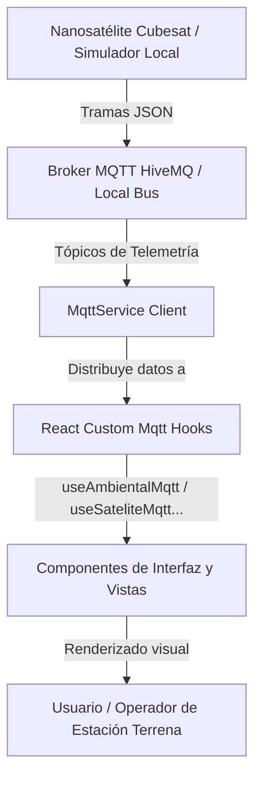

# 🛰️ Documentación Completa del Dashboard Cubesat (CEMPAI)

Este documento proporciona una descripción detallada, exhaustiva e informativa de todos los componentes, vistas, flujos de datos y características técnicas que integran la plataforma de control y monitoreo satelital en tiempo real para los nanosatélites de **CEMPAI Space Systems**.

---

## 📂 1. Estructura Completa del Proyecto

A continuación se detalla la distribución de archivos en el repositorio para comprender la modularidad de la aplicación:

*   **Raíz del Proyecto**:
    *   [package.json](file:///c:/Users/rodri/OneDrive/Escritorio/VisualStudioCode_Projects/DashboardCubesat/package.json): Gestión de dependencias, scripts de construcción (`vite`, `vite build`) y herramientas de linting (`eslint`).
    *   [vite.config.js](file:///c:/Users/rodri/OneDrive/Escritorio/VisualStudioCode_Projects/DashboardCubesat/vite.config.js): Configuración del bundler Vite. Contiene el middleware personalizado que actúa como backend de desarrollo para guardar, listar y borrar fotos en el disco duro local.
    *   [index.html](file:///c:/Users/rodri/OneDrive/Escritorio/VisualStudioCode_Projects/DashboardCubesat/index.html): Plantilla base HTML de la aplicación React.
    *   [eslint.config.js](file:///c:/Users/rodri/OneDrive/Escritorio/VisualStudioCode_Projects/DashboardCubesat/eslint.config.js): Reglas de formato y análisis de código.
    *   [Readme.md](file:///c:/Users/rodri/OneDrive/Escritorio/VisualStudioCode_Projects/DashboardCubesat/Readme.md): Guía rápida y visión general del proyecto.
*   **Directorio `src/`**:
    *   [main.jsx](file:///c:/Users/rodri/OneDrive/Escritorio/VisualStudioCode_Projects/DashboardCubesat/src/main.jsx): Punto de entrada de la aplicación React (montaje en el DOM).
    *   [App.jsx](file:///c:/Users/rodri/OneDrive/Escritorio/VisualStudioCode_Projects/DashboardCubesat/src/App.jsx): Enrutador principal de la aplicación (`react-router-dom`), definiendo el Layout global y los componentes de las vistas asociadas.
    *   [index.css](file:///c:/Users/rodri/OneDrive/Escritorio/VisualStudioCode_Projects/DashboardCubesat/src/index.css) y [App.css](file:///c:/Users/rodri/OneDrive/Escritorio/VisualStudioCode_Projects/DashboardCubesat/src/App.css): Estilos globales, tipografía personalizada (`JetBrains Mono`, `Orbitron`, `Inter`), colores del tema oscuro cibernético, variables de CSS y animaciones del sistema.
    *   [assets/](file:///c:/Users/rodri/OneDrive/Escritorio/VisualStudioCode_Projects/DashboardCubesat/src/assets): Iconos, estilos externos (como FontAwesome) y fuentes del sistema.
*   **Directorio `src/components/` (Componentes Compartidos)**:
    *   **`3d/`**:
        *   [CubeSatModel.jsx](file:///c:/Users/rodri/OneDrive/Escritorio/VisualStudioCode_Projects/DashboardCubesat/src/components/3d/CubeSatModel.jsx) y [CubeSatModel.css](file:///c:/Users/rodri/OneDrive/Escritorio/VisualStudioCode_Projects/DashboardCubesat/src/components/3d/CubeSatModel.css): Modelo 3D simplificado de un Cubesat utilizando Three.js puro, mostrando ejes cartesianos de orientación reactivos.
        *   [CubesatVisor3D.jsx](file:///c:/Users/rodri/OneDrive/Escritorio/VisualStudioCode_Projects/DashboardCubesat/src/components/3d/CubesatVisor3D.jsx) y [VistaGeneral3D.css](file:///c:/Users/rodri/OneDrive/Escritorio/VisualStudioCode_Projects/DashboardCubesat/src/components/3d/VistaGeneral3D.css): Visualizador 3D altamente detallado de la estructura interna del nanosatélite, renderizando sus paneles solares, placas de circuito impreso (PCB) en color verde esmeralda, varillas de latón pulido, raíles CNC de aluminio, antena y compartimento de paracaídas.
    *   **`Charts/`**:
        *   [SensorChart.jsx](file:///c:/Users/rodri/OneDrive/Escritorio/VisualStudioCode_Projects/DashboardCubesat/src/components/Charts/SensorChart.jsx) y [SensorChart.css](file:///c:/Users/rodri/OneDrive/Escritorio/VisualStudioCode_Projects/DashboardCubesat/src/components/Charts/SensorChart.css): Componente de renderizado de gráficos de área históricos optimizados y reactivos para visualizar tendencias en tiempo real.
    *   **`Layout/`**:
        *   [Layout.jsx](file:///c:/Users/rodri/OneDrive/Escritorio/VisualStudioCode_Projects/DashboardCubesat/src/components/Layout/Layout.jsx) y [Layout.css](file:///c:/Users/rodri/OneDrive/Escritorio/VisualStudioCode_Projects/DashboardCubesat/src/components/Layout/Layout.css): Estructura maestra del panel que organiza la barra superior, la barra lateral izquierda y el pie de página.
        *   [TopBar.jsx](file:///c:/Users/rodri/OneDrive/Escritorio/VisualStudioCode_Projects/DashboardCubesat/src/components/Layout/TopBar.jsx) y [TopBar.css](file:///c:/Users/rodri/OneDrive/Escritorio/VisualStudioCode_Projects/DashboardCubesat/src/components/Layout/TopBar.css): Barra superior que contiene una marquesina (marquee) de flujo continuo con las variables críticas de telemetría y una barra de progreso de scroll.
        *   [Sidebar.jsx](file:///c:/Users/rodri/OneDrive/Escritorio/VisualStudioCode_Projects/DashboardCubesat/src/components/Layout/Sidebar.jsx) y [Sidebar.css](file:///c:/Users/rodri/OneDrive/Escritorio/VisualStudioCode_Projects/DashboardCubesat/src/components/Layout/Sidebar.css): Navegador lateral interactivo con acceso a las 8 páginas y visualización destacada de la Fase de Misión actual.
        *   [BottomBar.jsx](file:///c:/Users/rodri/OneDrive/Escritorio/VisualStudioCode_Projects/DashboardCubesat/src/components/Layout/BottomBar.jsx) y [BottomBar.css](file:///c:/Users/rodri/OneDrive/Escritorio/VisualStudioCode_Projects/DashboardCubesat/src/components/Layout/BottomBar.css): Pie de página de diagnóstico con estado de conexión del broker, cantidad de sensores activos del computador de a bordo (OBC), calidad del enlace de radiofrecuencia (RF) y pérdida de paquetes.
    *   **`map/`**:
        *   [MapaOrbital.jsx](file:///c:/Users/rodri/OneDrive/Escritorio/VisualStudioCode_Projects/DashboardCubesat/src/components/map/MapaOrbital.jsx) y [MapaOrbital.css](file:///c:/Users/rodri/OneDrive/Escritorio/VisualStudioCode_Projects/DashboardCubesat/src/components/map/MapaOrbital.css): Mapa interactivo de Leaflet configurado con tema claro/oscuro que grafica la geolocalización actual y permite agregar marcadores al hacer clic.
*   **Directorio `src/mqtt/` (Lógica del Broker y Datos)**:
    *   **`config/`**:
        *   [mqttConfig.js](file:///c:/Users/rodri/OneDrive/Escritorio/VisualStudioCode_Projects/DashboardCubesat/src/mqtt/config/mqttConfig.js): Clase adaptadora del Broker MQTT. Implementa la suscripción y publicación local de datos. Permite cambiar el booleano `USE_REAL_MQTT` a `true` para conectar la estación mediante WebSockets al broker público HiveMQ.
    *   **`paquete_mqtt/` (Hooks React de Suscripción)**:
        *   Contiene ganchos personalizados (`useAmbientalMqtt`, `useComunicacionMqtt`, `useMisionMqtt`, `useOrientacion3DMqtt`, `useSateliteMqtt`, `useUbicacionMqtt`) que se suscriben a tópicos MQTT correspondientes y mantienen el estado local, buffers de histórico de datos de hasta 20 puntos y detección de pérdida/corrupción de tramas (verificación CRC, banderas de recepción).
    *   **`simulacion/` (Generación de Datos Mock en Desarrollo)**:
        *   Contiene generadores de telemetría simulada local (`ambientalMock`, `comunicacionMock`, `misionMock`, `orientacion3dMock`, `sateliteMock`, `ubicacionMock`) que inyectan periódicamente tramas realistas con ruidos aleatorios, perturbaciones y derivas físicas si la bandera de broker real está apagada.
*   **Directorio `src/pages/` (Vistas Principales)**:
    *   Cada una contiene sus correspondientes archivos `.jsx` de estructura y `.css` de diseño estético.

---

## 🛰️ 2. Arquitectura de Datos y Comunicación

El flujo de datos del panel opera bajo una arquitectura desacoplada basada en el patrón Pub/Sub (Publicación/Suscripción) sobre el protocolo MQTT.

### Protocolo de Telemetría (Tópicos MQTT)
El sistema procesa tramas formateadas en JSON distribuidas en **6 tópicos de telemetría**:

1.  **`cempai/cubesat/telemetry/ambiental`**:
    *   `co2_ppm`: Concentración de Dióxido de Carbono (ppm).
    *   `temperatura_c`: Temperatura ambiente (°C).
    *   `humedad_pct`: Humedad relativa (%).
    *   `presion_pa`: Presión barométrica (Pa).
    *   `radiacion_uv`: Índice de radiación ultravioleta.
2.  **`cempai/cubesat/telemetry/satelite`**:
    *   `voltaje_v`: Nivel de tensión de la batería principal (V).
    *   `corriente_ma`: Corriente de carga/descarga (mA).
    *   `consumo_w`: Potencia consumida en tiempo real (W).
    *   `temp_mcu`: Temperatura interna de la computadora de a bordo (OBC / ESP32).
    *   `sensores_activos`: Relación de sensores conectados operando.
    *   `accel_x` / `accel_y` / `accel_z`: Aceleraciones en ejes inerciales.
3.  **`cempai/cubesat/telemetry/mision`**:
    *   `fase_cdr` / `fase_ui`: Fase de vuelo oficial transmitida por la OBC (Inicialización, Ascenso, Descenso, Proximidad, Aterrizado).
4.  **`cempai/cubesat/telemetry/comunicacion`**:
    *   `calidad_enlace_pct`: Porcentaje de calidad del enlace RF (%).
    *   `paquetes_enviados` / `paquetes_recibidos` / `paquetes_perdidos`: Métricas acumulativas de la transmisión RF.
5.  **`cempai/cubesat/telemetry/orientacion3d`**:
    *   `cabeceo_deg` (Pitch) / `balanceo_deg` (Roll) / `giro_yaw_deg` (Yaw): Orientación angular derivada del sensor MPU6050.
    *   `gyro_x_dps` / `gyro_y_dps` / `gyro_z_dps`: Velocidades angulares por eje (°/s).
    *   `inercial_x` / `inercial_y` / `inercial_z`: Fuerzas inerciales estimadas (m/s²).

---

## 🖥️ 3. Detalle de las 8 Vistas del Dashboard

La aplicación web se divide en **8 módulos funcionales** accesibles desde la barra lateral. Cada uno ofrece herramientas únicas de visualización y análisis de datos:

### 1. Vista General (`/`)
Es la pantalla de inicio principal y actúa como un "centro de comando de un vistazo".
*   **Estado de Seguridad Ambiental**: Banner dinámico que evalúa los parámetros del satélite y muestra estados reactivos: **SEGURO** (todo normal), **EN RIESGO** (1-3 parámetros fuera de rango), **PELIGRO** / **CRÍTICO** (más de 3 alertas activas) y **ANOMALÍA** (en caso de caída drástica de presión).
*   **Modelado 3D de Estructura**: Renderiza el componente interactivo `CubesatVisor3D` mostrando el chasis de aluminio, las placas electrónicas internas y el compartimiento de paracaídas, el cual rota en tiempo real coincidiendo con la actitud real del satélite.
*   **Posicionamiento Orbital**: Muestra el mapa interactivo de posicionamiento GPS (`MapaOrbital`).
*   **Tarjetas de KPIs**: Cuadrícula cibernética que despliega los valores críticos: CO2, Temperatura, Radiación UV, Altitud, Voltaje de batería, Fase actual de la misión y Paquetes recibidos.

### 2. Monitoreo Ambiental (`/ambiental`)
Diseñado para controlar la atmósfera y seguridad interna/externa de la carga útil.
*   **Gauges Analógicos Interactivos**: Cinco medidores en forma de arco (Gauges) con gradientes de color que muestran dinámicamente CO2, Temperatura, Humedad, Presión y UV. Se iluminan y cambian de color (verde -> amarillo -> rojo) al cruzar los umbrales críticos de seguridad.
*   **Algoritmo de Detección de Descompresión Rápida**: Mide activamente la tasa de variación temporal de la presión barométrica ($\Delta P / \Delta t$ en Pascales por segundo). Si la presión cae más rápido de lo configurado (p. ej., por rotura de cabina o descenso acelerado), el sistema activa instantáneamente una alarma visual de descompresión crítica.
*   **Historial de Datos**: Cada sensor cuenta con su propio gráfico lineal (`SensorChart`) que almacena los últimos 20 valores recibidos para evaluar tendencias.

### 3. Ubicación y Mapa (`/ubicacion`)
Permite el seguimiento geográfico y el cálculo de distancias del nanosatélite en tiempo real.
*   **Datos GPS**: Cuadrantes detallados de Latitud, Longitud, Altitud, Velocidad terrestre (km/h), Distancia lineal acumulada al origen (m) y número de satélites GPS enganchados.
*   **Mapa Leaflet Interactivo**: Renderiza un mapa a pantalla completa con las siguientes funcionalidades:
    *   Localización automática del operador terrenal utilizando la Geolocation API del navegador (con fallback predeterminado a la ciudad de Lima).
    *   Marcador verde dinámico con efecto de ondas de pulso de radar que representa la posición en tiempo real.
    *   Permite al usuario hacer clic en cualquier parte del mapa para fijar un pin de destino azul, calculando y mostrando las coordenadas exactas de dicho punto en un cuadro de diálogo flotante.

### 4. Telemetría de Satélite (`/satelite`)
Módulo de diagnóstico para el estado eléctrico e inercial de la computadora interna.
*   **Consumo y Potencia**: Tarjetas premium que visualizan el Voltaje de la celda de batería (V), la Corriente activa consumida por la electrónica (mA) y el Consumo total medido en Watts (W).
*   **Salud del Procesador**: Monitorea la temperatura interna del microcontrolador de a bordo (MCU / ESP32) para prevenir fallas por sobrecalentamiento.
*   **Sensores Conectados**: Muestra un contador digital interactivo (ej. 7/7 sensores operativos) que verifica si los transductores I2C/SPI están respondiendo a la placa central.
*   **Gráficos Acelerométricos**: Curvas dinámicas que registran las aceleraciones de las fuerzas G en los ejes $X$, $Y$ y $Z$.

### 5. Estado de la Misión (`/mision`)
Control de la secuencia lógica de vuelo y estado de los actuadores mecánicos.
*   **Checklist de Fases de Vuelo**: Línea de tiempo visual que resalta en color verde brillante la fase en la que se encuentra el nanosatélite (Inicialización, Ascenso, Descenso, Proximidad, Aterrizado), lo que permite saber si los algoritmos de despliegue están operando secuencialmente.
*   **Modelo de Actitud 3D**: Renderiza una versión compacta interactiva de orientación para diagnosticar guiñada, cabeceo y alabeo.
*   **Detección de Deriva (Yaw Drift)**: Calcula y despliega un mensaje de advertencia si se detecta deriva acumulada en el cálculo del Giro (Yaw), alertando al operador sobre posibles desfases en los giróscopos de a bordo debido a la ausencia de calibración magnética activa.

### 6. Sistema de Comunicación (`/comunicacion`)
Métricas del enlace ascendente y descendente de RF.
*   **Calidad de Señal**: Un widget gráfico circular que simula un analizador de espectro que muestra el porcentaje de calidad de enlace RF actual.
*   **Contabilidad de Paquetes**: Desglose visual de paquetes enviados por el Cubesat, recibidos por la estación terrena y porcentaje de pérdida de paquetes totales.
*   **Terminal de Logs de Enlace**: Consola interactiva estilo CLI (interfaz de línea de comandos) de color negro y letras verdes en tiempo real. Imprime de forma secuencial los códigos de estado de los paquetes entrantes, incluyendo marcas de tiempo y el estado de la suma de verificación (CRC).

### 7. Orientación 3D Dedicada (`/orientacion3d`)
Sección dedicada al estudio cinemático e inercial del nanosatélite.
*   **Renderizado de Actitud de Alta Fidelidad**: Carga un espacio en 3D interactivo con el modelo `CubeSatModel` construido con Three.js que rota libremente siguiendo de manera idéntica los ángulos Euler (Pitch, Roll, Yaw) recibidos vía telemetría.
*   **Barras de Desplazamiento Euler**: Mapea numéricamente y de forma gráfica el movimiento angular de cada eje en un rango de $[-180^\circ, 180^\circ]$.
*   **Matriz de Sensores de Movimiento**: Muestra la lectura física de aceleración ($m/s^2$), velocidades angulares del giroscopio ($^\circ/s$) y la Fuerza Inercial Derivada en los tres ejes cartesianos.
*   **Gráficas de Análisis**: Seis gráficos de historial en tiempo real divididos en dos bloques: uno para ángulos de Euler y otro para las aceleraciones físicas de los ejes inerciales.

### 8. Análisis Visual por Visión (`/vision`)
Módulo avanzado para el procesamiento de imágenes y reconocimiento de objetos simulando la cámara FPV (First Person View) de a bordo.
*   **Transmisión de Video en Tiempo Real**: Feed dinámico que accede a la cámara web conectada al ordenador del operador, permitiendo seleccionar cámaras externas (USB) o integradas a través de un menú desplegable.
*   **Detección Inteligente de Objetos (TensorFlow.js)**: Carga de manera local en el navegador el modelo neuronal preentrenado **COCO-SSD** basado en MobileNet. Dibuja recuadros de delimitación (bounding boxes) con etiquetas inteligentes en color cian brillante cuando detecta personas o vehículos (autos, camiones, buses, motocicletas) en el campo visual.
*   **Cálculo Heurístico de Cobertura Vegetal**: Algoritmo en Javascript que analiza los canales de color (RGB) de cada píxel del cuadro capturado por la cámara. Empleando una regla matemática de predominancia verde ($G > R$ y $G > B$ con brillo mínimo), calcula dinámicamente qué porcentaje del suelo enfocado corresponde a vegetación activa.
*   **Galería de Fotos y Lightbox**:
    *   Un botón de obturador para capturar instantáneas.
    *   Una galería con carrusel inferior que despliega las fotos capturadas con sus respectivas marcas de tiempo.
    *   Lightbox interactivo para abrir imágenes en tamaño completo con soporte de navegación mediante el teclado (flechas izquierda/derecha para navegar, y ESC para cerrar).
    *   Botón para eliminar capturas, con un diálogo de confirmación para evitar borrados accidentales.

---

## 🛠️ 4. Mecanismos Técnicos Clave

### 💾 Middleware de Servidor para Fotos (Vite Custom Dev Server)
Para evitar la necesidad de configurar un servidor backend Node/Express independiente para almacenar y listar las fotos capturadas en la página de **Visión**, el archivo [vite.config.js](file:///c:/Users/rodri/OneDrive/Escritorio/VisualStudioCode_Projects/DashboardCubesat/vite.config.js) integra un middleware HTTP a nivel de servidor de desarrollo que intercepta y maneja las siguientes rutas:
*   `POST /api/save-capture`: Recibe la imagen capturada en base64 (formato PNG dataURL), la decodifica, crea el directorio `public/captures/` si no existe, y guarda el archivo en disco con una marca de tiempo única.
*   `GET /api/list-captures`: Lee el contenido de la carpeta de capturas y retorna una lista en formato JSON con los nombres de todos los archivos PNG guardados, ordenados de más reciente a más antiguo.
*   `POST /api/delete-capture`: Recibe un nombre de archivo, verifica que cumpla con el formato de seguridad (`capture_*.png`) y elimina físicamente la imagen del disco duro utilizando la biblioteca de archivos de Node (`fs.unlinkSync`).

### 🔌 Interruptor del Broker Real vs. Simulación
El archivo [mqttConfig.js](file:///c:/Users/rodri/OneDrive/Escritorio/VisualStudioCode_Projects/DashboardCubesat/src/mqtt/config/mqttConfig.js) es el centro nucleico de la conexión de datos:
*   Si `USE_REAL_MQTT` está en `true`, la clase inicia una conexión WebSocket real utilizando la biblioteca `mqtt` hacia el broker público `wss://broker.hivemq.com:8884/mqtt`. Al conectarse, se suscribe automáticamente a los tópicos reales de CEMPAI.
*   Si está en `false`, el sistema entra en modo simulación y los mocks locales inyectan datos aleatorios pero con dinámicas coherentes (por ejemplo, incrementando la altitud gradualmente en la fase de ascenso, y simulando ruidos térmicos en los sensores de batería).

---

## 🎨 5. Diseño Estético y Experiencia de Usuario
La interfaz del Dashboard Cubesat fue construida siguiendo pautas de diseño premium orientadas a interfaces de misiones de control espacial (Sci-Fi / Cyberpunk):
*   **Tema y Paleta**: Modo oscuro con un fondo profundo `#0a0d14` combinado con tarjetas con bordes delgados de colores reactivos (`cyan`, `rojo`, `verde esmeralda`, `amarillo ámbar` y `morado`).
*   **Glassmorphism**: Uso de propiedades CSS como `backdrop-filter: blur()` y fondos semitransparentes en tarjetas y menús flotantes, dando un aspecto futurista y de capas tridimensionales.
*   **Animaciones y Micro-interacciones**:
    *   Efecto de pulso en el marcador del mapa Leaflet y en el estado de conexión del broker MQTT en el pie de página.
    *   Efecto Flash de cámara interactivo (luz blanca que cubre la pantalla por 300 ms) al disparar el botón de captura en el feed FPV.
    *   Efectos de hover interactivo en tarjetas con sombras cian y desplazamientos sutiles para indicar interactividad.
