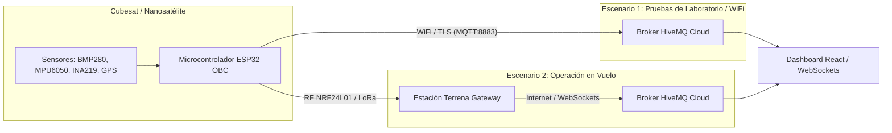

# 🛰️ Arquitectura de Telemetría ESP32 $\rightarrow$ HiveMQ $\rightarrow$ Dashboard

Este documento proporciona una guía técnica paso a paso y código listo para usar en **C++ / Arduino IDE** para el microcontrolador **ESP32** del Cubesat (o de la Estación Terrena). Muestra cómo capturar los sensores físicos (I2C, SPI, UART, ADC), construir la estructura exacta de paquetes JSON esperada por la interfaz y publicarlos en el Broker **HiveMQ**.

---

## 📡 Arquitectura de Transmisión

Existen dos esquemas de transmisión habituales:



---

## 🔌 Mapeo de Sensores Físicos a Campos JSON

| Subsistema / Tópico | Sensor Físico | Bus / Interfaz | Variable Físico | Campo JSON Generado |
| :--- | :--- | :--- | :--- | :--- |
| **Ambiental** | BME280 / BMP280 | I2C (`0x76`) | Presión Barométrica | `presion_pa` |
| **Ambiental** | BME280 / HTU21D | I2C (`0x76`) | Temp. Ambiente y Humedad | `temperatura_c`, `humedad_pct` |
| **Ambiental** | MQ135 | ADC (Pin `34` / `analogRead`) | CO₂ eq. / Calidad de Aire (calibrado en firmware) | `co2_ppm` |
| **Ambiental** | GUVA-S12SD | ADC (Pin `34`) | Sensor Radiación UV | `radiacion_uv` |
| **Satélite** | INA219 | I2C (`0x40`) | Voltaje y Corriente LiPo | `voltaje_v`, `corriente_ma`, `consumo_w` |
| **Satélite** | Interno ESP32 | Interno | Temp. MCU y Uptime | `temp_mcu`, `tiempo_encendido_seg` |
| **Orientación / Misión** | MPU6050 / BNO055 | I2C (`0x68`) | Acelerómetro y Giroscopio | `cabeceo_deg`, `balanceo_deg`, `accel_x/y/z` |
| **Ubicación** | NEO-6M / BN-880 | UART Serial (`TX2/RX2`) | Posición GPS 3D Fix | `latitud`, `longitud`, `altitud_gps`, `satelites` |

---

## 💻 Código C++ / Arduino para ESP32

A continuación se muestra un ejemplo funcional usando las librerías estándar **`PubSubClient`** (para MQTT/HiveMQ) y **`ArduinoJson`** (versión 6 u 7) para armar y enviar los paquetes exactos que espera el Dashboard.

### 📦 Dependencias (Librerías Arduino necesarias):
1. `PubSubClient` de Nick O'Leary
2. `ArduinoJson` de Benoit Blanchon (v6.x / v7.x)
3. `Adafruit BME280` / `Adafruit INA219` / `MPU6050` / `TinyGPS++`

---

```cpp
#include <WiFi.h>
#include <PubSubClient.h>
#include <ArduinoJson.h>
#include <Wire.h>
#include <Adafruit_BME280.h>
#include <Adafruit_INA219.h>
#include <MPU6050.h>
#include <TinyGPS++.h>
#include <HardwareSerial.h>

// ── Configuraciones de Red y Broker HiveMQ ──────────────────────────────────
const char* WIFI_SSID     = "TU_RED_WIFI";
const char* WIFI_PASSWORD = "TU_CONTRASEÑA";

const char* MQTT_BROKER   = "broker.hivemq.com";
const int   MQTT_PORT     = 1883;  // Sin TLS (pruebas). TLS: 8883 + WiFiClientSecure

// ── Tópicos MQTT (6 tópicos del dashboard) ───────────────────────────────────
const char* TOPIC_AMBIENTAL   = "cempai/cubesat/telemetry/ambiental";
const char* TOPIC_SATELITE    = "cempai/cubesat/telemetry/satelite";
const char* TOPIC_UBICACION   = "cempai/cubesat/telemetry/ubicacion";
const char* TOPIC_ORIENTACION = "cempai/cubesat/telemetry/orientacion3d";
const char* TOPIC_MISION      = "cempai/cubesat/telemetry/mision";
const char* TOPIC_COMUNICACION= "cempai/cubesat/telemetry/comunicacion";

// ── Objetos de Sensores ──────────────────────────────────────────────────────
Adafruit_BME280  bme;
Adafruit_INA219  ina219;
MPU6050          mpu;
TinyGPSPlus      gps;
HardwareSerial   gpsSerial(2);   // UART2: RX2=GPIO16, TX2=GPIO17

WiFiClient       espClient;
PubSubClient     mqttClient(espClient);

// ── Pines ADC ────────────────────────────────────────────────────────────────
#define PIN_MQ135  34    // MQ135 — CO2 eq.
#define PIN_UV     35    // GUVA-S12SD — UV

// ── Contadores de paquetes independientes por tópico ─────────────────────────
static uint32_t pkt_amb = 1000;
static uint32_t pkt_sat = 3000;
static uint32_t pkt_gps = 2000;
static uint32_t pkt_ori = 4000;
static uint32_t pkt_mis = 5000;
static uint32_t pkt_com = 6000;

// ── Stats de RF para tópico comunicacion ─────────────────────────────────────
static uint32_t totalEnviados  = 0;
static uint32_t totalRecibidos = 0;
static uint32_t totalPerdidos  = 0;
static bool     recentWindow[20];

// ── Calibración MQ135 ────────────────────────────────────────────────────────
// Ajustar MQ135_RZERO en aire limpio exterior (debe dar ~400 ppm)
const float MQ135_RZERO = 76.63;
const float MQ135_RLOAD = 10.0;
const float MQ135_PARA  = 116.6020682;
const float MQ135_PARB  = 2.769034857;

float mq135_get_ppm() {
  int   raw  = analogRead(PIN_MQ135);
  float volt = (raw / 4095.0f) * 3.3f;
  if (volt < 0.01f) return 400.0f;
  float rs    = ((3.3f - volt) / volt) * MQ135_RLOAD;
  float ratio = rs / MQ135_RZERO;
  float ppm   = MQ135_PARA * powf(ratio, -MQ135_PARB);
  return constrain(ppm, 400.0f, 5000.0f);
}

// ── Inicialización ───────────────────────────────────────────────────────────
void setup() {
  Serial.begin(115200);
  gpsSerial.begin(9600, SERIAL_8N1, 16, 17);

  Wire.begin();
  bme.begin(0x76);
  ina219.begin();
  mpu.initialize();

  // Inicializar ventana de paquetes RF
  for (int i = 0; i < 20; i++) recentWindow[i] = true;

  WiFi.begin(WIFI_SSID, WIFI_PASSWORD);
  while (WiFi.status() != WL_CONNECTED) { delay(500); Serial.print("."); }
  Serial.println("\n[WiFi] Conectado.");

  mqttClient.setServer(MQTT_BROKER, MQTT_PORT);
  mqttClient.setBufferSize(1024);  // CRÍTICO: JSONs del dashboard superan 256 bytes
}

// ── Reconexión Automática a MQTT ─────────────────────────────────────────────
void reconnectMQTT() {
  while (!mqttClient.connected()) {
    String clientId = "ESP32_CEMPAI_" + String(random(0xffff), HEX);
    Serial.print("[MQTT] Conectando...");
    if (mqttClient.connect(clientId.c_str())) {
      Serial.println(" OK");
    } else {
      Serial.printf(" Error rc=%d. Reintentando...\n", mqttClient.state());
      delay(2000);
    }
  }
}

// ════════════════════════════════════════════════════════════════════════════
// FUNCIÓN 1 — Tópico: ambiental
// Sensores: BME280 (temp/hum/pres) · MQ135 ADC (CO2 eq.) · GUVA-S12SD ADC (UV)
// ════════════════════════════════════════════════════════════════════════════
void publicarAmbiental() {
  pkt_amb++;

  float co2_ppm  = mq135_get_ppm();
  float temp_c   = bme.readTemperature();
  float hum_pct  = bme.readHumidity();

  float pres_abs = bme.readPressure();
  static float  pres_base = pres_abs;
  static bool   base_set  = false;
  if (!base_set) { pres_base = pres_abs; base_set = true; }
  float pres_rel = pres_abs - pres_base;

  int   uv_raw  = analogRead(PIN_UV);
  float uv_volt = (uv_raw / 4095.0f) * 3.3f;
  float uv_idx  = constrain(uv_volt / 0.1f, 0.0f, 15.0f);

  bool alert = (co2_ppm > 1000) || (temp_c > 40) ||
               (hum_pct > 85)   || (fabsf(pres_rel) > 45) || (uv_idx > 7.5);

  StaticJsonDocument<1024> doc;
  doc["topic"]            = TOPIC_AMBIENTAL;
  doc["packet_id"]        = pkt_amb;
  doc["received"]         = true;
  doc["crc_valido"]       = true;
  doc["estado_ambiental"] = alert ? "PELIGRO" : "SEGURO";

  JsonObject data = doc.createNestedObject("data");

  JsonObject co2  = data.createNestedObject("co2_ppm");
  co2["v"]  = round(co2_ppm * 100) / 100.0;  co2["hace_seg"] = 0.0;  co2["umbral_alerta"] = 1000;

  JsonObject temp = data.createNestedObject("temperatura_c");
  temp["v"] = round(temp_c * 10)  / 10.0;   temp["hace_seg"] = 0.0; temp["umbral_alerta"] = 40;

  JsonObject hum  = data.createNestedObject("humedad_pct");
  hum["v"]  = round(hum_pct * 10) / 10.0;   hum["hace_seg"]  = 0.0; hum["umbral_alerta"]  = 85;

  JsonObject pres = data.createNestedObject("presion_pa");
  pres["v"] = round(pres_rel * 100) / 100.0; pres["hace_seg"] = 0.0; pres["umbral_alerta"] = 45;

  JsonObject uv   = data.createNestedObject("radiacion_uv");
  uv["v"]   = round(uv_idx * 10)  / 10.0;   uv["hace_seg"]   = 0.0; uv["umbral_alerta"]   = 7.5;

  char buffer[1024];
  size_t bytes = serializeJson(doc, buffer);
  mqttClient.publish(TOPIC_AMBIENTAL, buffer, bytes);
  Serial.printf("[TX AMB] pkt#%d (%d bytes)\n", pkt_amb, bytes);
}

// ════════════════════════════════════════════════════════════════════════════
// FUNCIÓN 2 — Tópico: satelite
// Sensores: INA219 (voltaje/corriente) · MPU6050 (accel raw) · ESP32 interno
// ════════════════════════════════════════════════════════════════════════════
void publicarSatelite() {
  pkt_sat++;

  float volt_v  = ina219.getBusVoltage_V();
  float curr_ma = ina219.getCurrent_mA();
  float power_w = (volt_v * curr_ma) / 1000.0f;

  int16_t ax, ay, az, gx, gy, gz;
  mpu.getMotion6(&ax, &ay, &az, &gx, &gy, &gz);
  float accel_x = (ax / 16384.0f) * 9.81f;
  float accel_y = (ay / 16384.0f) * 9.81f;
  float accel_z = (az / 16384.0f) * 9.81f;

  float    temp_mcu = temperatureRead();
  uint32_t uptime   = millis() / 1000;

  StaticJsonDocument<1024> doc;
  doc["topic"]      = TOPIC_SATELITE;
  doc["packet_id"]  = pkt_sat;
  doc["received"]   = true;
  doc["crc_valido"] = true;

  JsonObject data = doc.createNestedObject("data");
  data["voltaje_v"]["v"]             = round(volt_v  * 100) / 100.0;
  data["voltaje_v"]["hace_seg"]      = 0.0;
  data["corriente_ma"]["v"]          = round(curr_ma * 10)  / 10.0;
  data["corriente_ma"]["hace_seg"]   = 0.0;
  data["consumo_w"]["v"]             = round(power_w * 100) / 100.0;
  data["consumo_w"]["hace_seg"]      = 0.0;
  data["accel_x"]["v"]               = round(accel_x * 10) / 10.0;
  data["accel_x"]["hace_seg"]        = 0.0;
  data["accel_y"]["v"]               = round(accel_y * 10) / 10.0;
  data["accel_y"]["hace_seg"]        = 0.0;
  data["accel_z"]["v"]               = round(accel_z * 10) / 10.0;
  data["accel_z"]["hace_seg"]        = 0.0;
  data["temp_mcu"]["v"]              = round(temp_mcu * 10) / 10.0;
  data["temp_mcu"]["hace_seg"]       = 0.0;
  data["tiempo_encendido_seg"]["v"]  = uptime;
  data["tiempo_encendido_seg"]["hace_seg"] = 0.0;
  data["memoria_flash_ok"]["v"]      = true;
  data["memoria_flash_ok"]["hace_seg"] = 0.0;

  JsonObject sens = data.createNestedObject("sensores_activos");
  sens["v"] = 7;  sens["total"] = 7;  sens["hace_seg"] = 0.0;

  char buffer[1024];
  size_t bytes = serializeJson(doc, buffer);
  mqttClient.publish(TOPIC_SATELITE, buffer, bytes);
  Serial.printf("[TX SAT] pkt#%d (%d bytes)\n", pkt_sat, bytes);
}

// ════════════════════════════════════════════════════════════════════════════
// FUNCIÓN 3 — Tópico: ubicacion
// Sensor: u-blox NEO-7M vía UART2 (TinyGPS++)
// ════════════════════════════════════════════════════════════════════════════
void publicarUbicacion() {
  // Leer tramas NMEA pendientes en el buffer UART
  while (gpsSerial.available()) gps.encode(gpsSerial.read());

  pkt_gps++;

  char fecha[12], hora[10];
  if (gps.date.isValid())
    sprintf(fecha, "%04d-%02d-%02d", gps.date.year(), gps.date.month(), gps.date.day());
  else strcpy(fecha, "0000-00-00");

  if (gps.time.isValid())
    sprintf(hora, "%02d:%02d:%02d", gps.time.hour(), gps.time.minute(), gps.time.second());
  else strcpy(hora, "00:00:00");

  StaticJsonDocument<1024> doc;
  doc["topic"]      = TOPIC_UBICACION;
  doc["packet_id"]  = pkt_gps;
  doc["received"]   = true;
  doc["crc_valido"] = true;

  JsonObject data = doc.createNestedObject("data");
  data["latitud"]["v"]            = gps.location.isValid() ? gps.location.lat() : 0.0;
  data["latitud"]["hace_seg"]     = 0.0;
  data["longitud"]["v"]           = gps.location.isValid() ? gps.location.lng() : 0.0;
  data["longitud"]["hace_seg"]    = 0.0;
  data["altitud_gps"]["v"]        = gps.altitude.isValid() ? (round(gps.altitude.meters() * 10) / 10.0) : 0.0;
  data["altitud_gps"]["hace_seg"] = 0.0;
  data["velocidad_kmh"]["v"]      = gps.speed.isValid() ? (round(gps.speed.kmph() * 10) / 10.0) : 0.0;
  data["velocidad_kmh"]["hace_seg"] = 0.0;
  data["velocidad_vertical"]["v"] = 0.0;   // NEO-7M no entrega vel. vertical directa
  data["velocidad_vertical"]["hace_seg"] = 0.0;
  data["satelites"]["v"]          = gps.satellites.isValid() ? gps.satellites.value() : 0;
  data["satelites"]["hace_seg"]   = 0.0;
  data["hdop"]["v"]               = gps.hdop.isValid() ? gps.hdop.hdop() : 99.9;
  data["hdop"]["hace_seg"]        = 0.0;
  data["calidad_senal"]["v"]      = gps.satellites.isValid() ? min((uint32_t)10, gps.satellites.value()) : 0;
  data["calidad_senal"]["hace_seg"] = 0.0;
  data["distancia_origen"]["v"]   = 0.0;   // Implementar con haversine si se requiere
  data["distancia_origen"]["hace_seg"] = 0.0;
  data["fecha_utc"]               = fecha;
  data["hora_utc"]                = hora;

  JsonObject aterrizaje = data.createNestedObject("coordenadas_aterrizaje");
  aterrizaje["lat"] = -12.0780;   // Coordenada de aterrizaje prevista (ajustar)
  aterrizaje["lon"] = -77.0850;

  char buffer[1024];
  size_t bytes = serializeJson(doc, buffer);
  mqttClient.publish(TOPIC_UBICACION, buffer, bytes);
  if (gps.location.isValid()) {
    Serial.printf("[TX GPS] pkt#%d lat=%.6f lon=%.6f alt=%.1fm\n",
      pkt_gps, gps.location.lat(), gps.location.lng(), gps.altitude.meters());
  } else {
    Serial.printf("[TX GPS] pkt#%d NO FIX (sats=%d)\n", pkt_gps, gps.satellites.isValid() ? gps.satellites.value() : 0);
  }
}

// ════════════════════════════════════════════════════════════════════════════
// FUNCIÓN 4 — Tópico: orientacion3d
// Sensor: MPU6050 — Pitch, Roll, Yaw integrado, giroscopio y acelerómetro
// ════════════════════════════════════════════════════════════════════════════
void publicarOrientacion3D() {
  pkt_ori++;

  int16_t ax, ay, az, gx, gy, gz;
  mpu.getMotion6(&ax, &ay, &az, &gx, &gy, &gz);

  float accel_x = ax / 16384.0f;   // g
  float accel_y = ay / 16384.0f;
  float accel_z = az / 16384.0f;
  float gyro_x  = gx / 131.0f;     // °/s
  float gyro_y  = gy / 131.0f;
  float gyro_z  = gz / 131.0f;

  // Ángulos desde acelerómetro (sin filtro complementario — solo referencia estática)
  float pitch = atan2f(accel_y, sqrtf(accel_x*accel_x + accel_z*accel_z)) * 180.0f / PI;
  float roll  = atan2f(-accel_x, accel_z) * 180.0f / PI;

  // Integración del yaw con acumulación de deriva (~0.02°/s)
  static float         yaw_deg     = 0.0f;
  static float         drift_total = 0.0f;
  static unsigned long last_t      = 0;
  unsigned long now_t = millis();
  float dt = (now_t - last_t) / 1000.0f;
  last_t = now_t;
  if (dt > 0 && dt < 2.0f) {
    yaw_deg     += gyro_z * dt;
    drift_total += 0.02f * dt;
  }
  yaw_deg = fmodf(yaw_deg + 360.0f, 360.0f);

  StaticJsonDocument<1024> doc;
  doc["topic"]      = TOPIC_ORIENTACION;
  doc["packet_id"]  = pkt_ori;
  doc["received"]   = true;
  doc["crc_valido"] = true;

  JsonObject data = doc.createNestedObject("data");
  data["cabeceo_deg"]["v"]  = round(pitch * 10) / 10.0;
  data["cabeceo_deg"]["hace_seg"] = 0.0;
  data["balanceo_deg"]["v"] = round(roll  * 10) / 10.0;
  data["balanceo_deg"]["hace_seg"] = 0.0;

  JsonObject yaw_obj = data.createNestedObject("giro_yaw_deg");
  yaw_obj["v"]               = round(yaw_deg * 10) / 10.0;
  yaw_obj["hace_seg"]        = 0.0;
  yaw_obj["drift_acumulado"] = round(drift_total * 100) / 100.0;

  data["accel_x"]["v"]     = round(accel_x * 9.81f * 10) / 10.0;
  data["accel_x"]["hace_seg"] = 0.0;
  data["accel_y"]["v"]     = round(accel_y * 9.81f * 10) / 10.0;
  data["accel_y"]["hace_seg"] = 0.0;
  data["accel_z"]["v"]     = round(accel_z * 9.81f * 10) / 10.0;
  data["accel_z"]["hace_seg"] = 0.0;
  data["gyro_x_dps"]["v"]  = round(gyro_x * 100) / 100.0;
  data["gyro_x_dps"]["hace_seg"] = 0.0;
  data["gyro_y_dps"]["v"]  = round(gyro_y * 100) / 100.0;
  data["gyro_y_dps"]["hace_seg"] = 0.0;
  data["gyro_z_dps"]["v"]  = round(gyro_z * 100) / 100.0;
  data["gyro_z_dps"]["hace_seg"] = 0.0;
  data["inercial_x"]["v"]  = round(fabsf(accel_x * 9.81f) * 0.1f * 100) / 100.0;
  data["inercial_x"]["hace_seg"] = 0.0;
  data["inercial_y"]["v"]  = round(fabsf(accel_y * 9.81f) * 0.1f * 100) / 100.0;
  data["inercial_y"]["hace_seg"] = 0.0;
  data["inercial_z"]["v"]  = round(fabsf(accel_z * 9.81f) * 0.1f * 100) / 100.0;
  data["inercial_z"]["hace_seg"] = 0.0;

  char buffer[1024];
  size_t bytes = serializeJson(doc, buffer);
  mqttClient.publish(TOPIC_ORIENTACION, buffer, bytes);
  Serial.printf("[TX ORI] pkt#%d pitch=%.1f roll=%.1f yaw=%.1f\n",
    pkt_ori, pitch, roll, yaw_deg);
}

// ════════════════════════════════════════════════════════════════════════════
// FUNCIÓN 5 — Tópico: mision
// Fuente: Máquina de estados CDR interna + MPU6050 para orientación
// ════════════════════════════════════════════════════════════════════════════

// Máquina de estados CDR (7 fases)
const char* CDR_FASES[] = {
  "PREPARACION_TIERRA",
  "INTEGRACION_ACOPLAMIENTO",
  "DESPEGUE_ASCENSO",
  "ALTURA_MAXIMA_DESACOPLE",
  "DESCENSO_CONTROLADO",
  "ATERRIZAJE",
  "RECUPERACION"
};
const char* UI_FASES[] = {
  "INICIALIZACION", "INICIALIZACION",
  "ASCENSO / LANZAMIENTO", "DESCENSO",
  "DESCENSO", "ATERRIZADO", "ATERRIZADO"
};

// Variables de estado de misión — actualizar desde sensores o comandos externos
static int      fase_idx       = 0;    // 0–6 según CDR_FASES
static float    altitud_m      = 0.0f; // Altitud de misión (puede venir del GPS)
static float    vel_vert_ms    = 0.0f; // Velocidad vertical m/s
static uint32_t t_vuelo_seg    = 0;    // Tiempo de vuelo acumulado

void publicarMision() {
  pkt_mis++;
  t_vuelo_seg = millis() / 1000;

  // Leer GPS para altitud si hay fix
  while (gpsSerial.available()) gps.encode(gpsSerial.read());
  if (gps.altitude.isValid()) altitud_m = gps.altitude.meters();

  // Leer orientación del MPU6050
  int16_t ax, ay, az, gx, gy, gz;
  mpu.getMotion6(&ax, &ay, &az, &gx, &gy, &gz);
  float accel_x = ax / 16384.0f;
  float accel_y = ay / 16384.0f;
  float accel_z = az / 16384.0f;
  float gyro_z  = gz / 131.0f;
  float pitch = atan2f(accel_y, sqrtf(accel_x*accel_x + accel_z*accel_z)) * 180.0f / PI;
  float roll  = atan2f(-accel_x, accel_z) * 180.0f / PI;

  static float yaw_mis    = 0.0f;
  static float drift_mis  = 0.0f;
  static unsigned long lt = 0;
  unsigned long nt = millis();
  float dt = (nt - lt) / 1000.0f;
  lt = nt;
  if (dt > 0 && dt < 2.0f) { yaw_mis += gyro_z * dt; drift_mis += 0.02f * dt; }
  yaw_mis = fmodf(yaw_mis + 360.0f, 360.0f);

  const char* fase_ui = UI_FASES[fase_idx];
  // Sub-estado: PROXIMIDAD AL SUELO si descendiendo a baja altura
  if (fase_idx == 4 && altitud_m <= 20.0f) fase_ui = "PROXIMIDAD AL SUELO";

  StaticJsonDocument<1024> doc;
  doc["topic"]      = TOPIC_MISION;
  doc["packet_id"]  = pkt_mis;
  doc["received"]   = true;
  doc["crc_valido"] = true;

  JsonObject data = doc.createNestedObject("data");
  data["fase_cdr"]       = CDR_FASES[fase_idx];
  data["fase_cdr_index"] = fase_idx;
  data["fase_ui"]        = fase_ui;

  data["altitud_m"]["v"]             = round(altitud_m   * 10) / 10.0;
  data["altitud_m"]["hace_seg"]      = 0.0;
  data["velocidad_vertical_ms"]["v"] = round(vel_vert_ms * 100) / 100.0;
  data["velocidad_vertical_ms"]["hace_seg"] = 0.0;
  data["t_vuelo_seg"]["v"]           = t_vuelo_seg;
  data["t_vuelo_seg"]["hace_seg"]    = 0.0;
  data["cabeceo_deg"]["v"]           = round(pitch    * 10)  / 10.0;
  data["cabeceo_deg"]["hace_seg"]    = 0.0;
  data["balanceo_deg"]["v"]          = round(roll     * 10)  / 10.0;
  data["balanceo_deg"]["hace_seg"]   = 0.0;
  data["sd_card_status"]             = "N/A";  // Sin SD Card confirmada en hardware

  JsonObject yaw_obj = data.createNestedObject("giro_yaw_deg");
  yaw_obj["v"]               = round(yaw_mis   * 10) / 10.0;
  yaw_obj["hace_seg"]        = 0.0;
  yaw_obj["drift_acumulado"] = round(drift_mis * 100) / 100.0;

  char buffer[1024];
  size_t bytes = serializeJson(doc, buffer);
  mqttClient.publish(TOPIC_MISION, buffer, bytes);
  Serial.printf("[TX MIS] pkt#%d fase=%s alt=%.1fm\n",
    pkt_mis, CDR_FASES[fase_idx], altitud_m);
}

// ════════════════════════════════════════════════════════════════════════════
// FUNCIÓN 6 — Tópico: comunicacion
// Fuente: NRF24L01 — estadísticas del enlace RF y log de tramas
// ════════════════════════════════════════════════════════════════════════════
void publicarComunicacion(bool paqueteRecibido, bool crcOk) {
  pkt_com++;
  totalEnviados++;

  // Actualizar ventana deslizante de 20 paquetes
  for (int i = 0; i < 19; i++) recentWindow[i] = recentWindow[i + 1];
  recentWindow[19] = paqueteRecibido && crcOk;

  if (paqueteRecibido && crcOk)  totalRecibidos++;
  else                            totalPerdidos++;

  // Calcular calidad de enlace (% de éxitos en ventana de 20 paquetes)
  int okCount = 0;
  for (int i = 0; i < 20; i++) if (recentWindow[i]) okCount++;
  float calidad_pct = (okCount / 20.0f) * 100.0f;

  const char* calidad_label = "Excelente";
  if      (calidad_pct < 70) calidad_label = "Débil / Inestable";
  else if (calidad_pct < 85) calidad_label = "Regular";
  else if (calidad_pct < 95) calidad_label = "Buena";

  // Timestamp del paquete actual
  char ts[10];
  unsigned long s = millis() / 1000;
  sprintf(ts, "%02lu:%02lu:%02lu", (s / 3600) % 24, (s / 60) % 60, s % 60);

  // Entrada de log
  char logText[64];
  if      (!paqueteRecibido) sprintf(logText, "PKT#%03d - Packet Lost / Timeout", pkt_com);
  else if (!crcOk)           sprintf(logText, "PKT#%03d - Checksum Error (CRC Invalid)", pkt_com);
  else                       sprintf(logText, "PKT#%03d - CMD:ACK - OBC ONLINE", pkt_com);

  StaticJsonDocument<1024> doc;
  doc["topic"]      = TOPIC_COMUNICACION;
  doc["packet_id"]  = pkt_com;
  doc["received"]   = paqueteRecibido;
  doc["crc_valido"] = crcOk ? true : false;

  JsonObject data = doc.createNestedObject("data");
  data["paquetes_enviados"]["v"]    = totalEnviados;
  data["paquetes_enviados"]["hace_seg"] = 0.0;
  data["paquetes_recibidos"]["v"]   = totalRecibidos;
  data["paquetes_recibidos"]["hace_seg"] = 0.0;
  data["paquetes_perdidos"]["v"]    = totalPerdidos;
  data["paquetes_perdidos"]["hace_seg"] = 0.0;
  data["frecuencia_ghz"]["v"]       = 2.401;  // NRF24L01 Canal 1 (CDR Fix)
  data["frecuencia_ghz"]["hace_seg"] = 0.0;
  data["canal_nrf24"]["v"]          = 1;
  data["calidad_enlace_pct"]["v"]   = round(calidad_pct * 10) / 10.0;
  data["calidad_enlace_pct"]["hace_seg"] = 0.0;
  data["calidad_label"]             = calidad_label;
  data["baudios_debug"]["v"]        = 115200;
  data["tasa_aire_nrf24_kbps"]["v"] = 2000;
  data["ultimo_pkt_timestamp"]      = ts;

  JsonObject log_entry = data.createNestedObject("log_entry");
  log_entry["timestamp"] = ts;
  log_entry["status"]    = (!paqueteRecibido) ? "RX TIMEOUT"
                         : (!crcOk)           ? "RX ERROR"
                                              : "RX OK";
  log_entry["text"]      = logText;

  JsonArray pkts_window = data.createNestedArray("pkts_window");
  for (int i = 0; i < 20; i++) pkts_window.add(recentWindow[i]);

  char buffer[1024];
  size_t bytes = serializeJson(doc, buffer);
  mqttClient.publish(TOPIC_COMUNICACION, buffer, bytes);
  Serial.printf("[TX COM] pkt#%d calidad=%.1f%% %s\n",
    pkt_com, calidad_pct, calidad_label);
}

// ── Bucle Principal ──────────────────────────────────────────────────────────
void loop() {
  if (!mqttClient.connected()) reconnectMQTT();
  mqttClient.loop();

  // Leer GPS en cada iteración (no bloquear)
  while (gpsSerial.available()) gps.encode(gpsSerial.read());

  static unsigned long lastPub = 0;
  unsigned long now = millis();

  if (now - lastPub >= 750) {   // Publicar todos los tópicos cada ~750ms
    lastPub = now;

    publicarAmbiental();
    publicarSatelite();
    publicarUbicacion();
    publicarOrientacion3D();
    publicarMision();

    // publicarComunicacion() recibe el estado del último intercambio NRF24.
    // Pasar true/true en laboratorio; en vuelo, pasar el resultado real del NRF24.
    publicarComunicacion(true, true);
  }
}
```

---

## 🔑 Claves para Garantizar la Compatibilidad con la Interfaz

1. **`hace_seg: 0.0` siempre en `0.0`**: El frontend calcula la antigüedad del dato en tiempo real a partir de la hora de llegada del paquete. El ESP32 siempre envía `0.0`.
2. **Formato Decimal**: Los valores deben ser numéricos, **no cadenas de texto** (`"12.31"` ❌ → `12.31` ✅).
3. **Buffer MQTT suficiente**: Llamar `mqttClient.setBufferSize(1024)` en `setup()`. El valor por defecto de 256 bytes **no alcanza** para los JSONs del sistema.
4. **Control de Errores CRC**: Si el NRF24 detecta CRC corrupto en tierra, publicar el paquete con `"received": true, "crc_valido": false` — la UI mostrará alerta visual de trama corrupta.
5. **Máquina de estados CDR**: La variable `fase_idx` en `publicarMision()` debe actualizarse según los eventos reales del vuelo (umbral de altitud, señal de desacople, etc.). No dejarla fija en `0`.
6. **MQ135**: Requiere **24h de precalentamiento** y calibración de `MQ135_RZERO` al aire libre para valores confiables de CO₂ eq.

