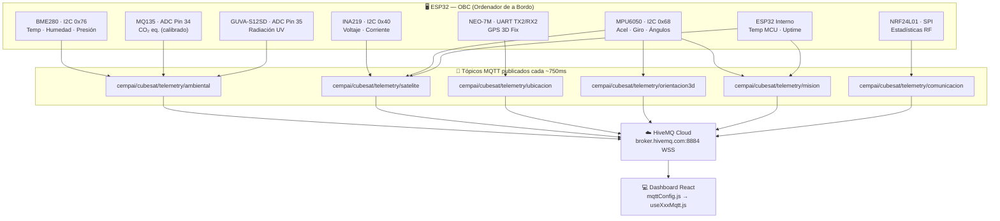

# 📡 Protocolo MQTT — CEMPAI CubeSat
### Referencia Completa: ESP32 → HiveMQ → Dashboard React

> **Versión hardware actual:** BME280 · MQ135 · GUVA-S12SD · u-blox NEO-7M · INA219 · MPU6050 · NRF24L01 · ESP32 OBC

---

## 🗺️ Arquitectura del Flujo de Datos



---

## 📦 Estructura Base de Todos los Paquetes (Envelope)

Todo paquete MQTT del sistema sigue este **sobre exterior** obligatorio:

```json
{
  "topic":      "cempai/cubesat/telemetry/<subsistema>",
  "packet_id":  1042,
  "received":   true,
  "crc_valido": true,
  "data": { ... }
}
```

| Campo | Tipo | Descripción |
|---|---|---|
| `topic` | `string` | Tópico MQTT al que pertenece el paquete |
| `packet_id` | `number` | Contador incremental único por subsistema |
| `received` | `boolean` | `false` = paquete perdido (sin datos) |
| `crc_valido` | `boolean \| null` | `false` = CRC corrupto · `null` = paquete perdido |
| `data` | `object \| null` | Payload con los datos del sensor. `null` si `received=false` |

> ⚠️ Se simula un **8% de pérdida de paquetes** y **2% de CRC corrupto** — idéntico al enlace NRF24L01 real.

Los valores de cada campo dentro de `data` siguen este sub-esquema:

```json
"nombre_campo": {
  "v":             <número>,
  "hace_seg":      0.0,
  "umbral_alerta": 1000
}
```

---

## 🌡️ Tópico 1 — `ambiental`

**Sensores:** BME280 · MQ135 · GUVA-S12SD
**Frecuencia:** ~750 ms
**Tópico:** `cempai/cubesat/telemetry/ambiental`

### JSON Completo — Paquete Exitoso

```json
{
  "topic":      "cempai/cubesat/telemetry/ambiental",
  "packet_id":  1042,
  "received":   true,
  "crc_valido": true,
  "estado_ambiental": "SEGURO",
  "data": {
    "co2_ppm": {
      "v":             450.32,
      "hace_seg":      0.0,
      "umbral_alerta": 1000
    },
    "temperatura_c": {
      "v":             24.8,
      "hace_seg":      0.0,
      "umbral_alerta": 40
    },
    "humedad_pct": {
      "v":             55.4,
      "hace_seg":      0.0,
      "umbral_alerta": 85
    },
    "presion_pa": {
      "v":             -17.5,
      "hace_seg":      0.0,
      "umbral_alerta": 45
    },
    "radiacion_uv": {
      "v":             2.1,
      "hace_seg":      0.0,
      "umbral_alerta": 7.5
    }
  }
}
```

### JSON — Paquete Perdido (received: false)

```json
{
  "topic":      "cempai/cubesat/telemetry/ambiental",
  "packet_id":  1043,
  "received":   false,
  "crc_valido": null,
  "estado_ambiental": "SIN_DATOS",
  "data":       null
}
```

### Umbrales y Rangos Ambiental

| Campo JSON | Sensor | Rango Normal | Alerta | Unidad |
|---|---|---|---|---|
| `co2_ppm` | MQ135 (ADC) | 400 – 1000 | > 1000 | ppm |
| `temperatura_c` | BME280 | -10 – 40 | > 40 | °C |
| `humedad_pct` | BME280 | 0 – 85 | > 85 | %RH |
| `presion_pa` | BME280 | ±45 Pa | \|P\| > 45 | Pa (relativa al lanzamiento) |
| `radiacion_uv` | GUVA-S12SD | 0 – 7.5 | > 7.5 | UV index |

> **Nota presión:** El valor es **relativo al lanzamiento (0 Pa)**. El dashboard además detecta anomalías de *tasa de cambio* (> 25 Pa/s) como alerta de descompresión.

---

## 🛰️ Tópico 2 — `satelite`

**Sensores:** INA219 · MPU6050 · ESP32 OBC interno
**Frecuencia:** ~750 ms
**Tópico:** `cempai/cubesat/telemetry/satelite`

### JSON Completo

```json
{
  "topic":      "cempai/cubesat/telemetry/satelite",
  "packet_id":  3001,
  "received":   true,
  "crc_valido": true,
  "data": {
    "voltaje_v":            { "v": 12.34, "hace_seg": 0.0 },
    "corriente_ma":         { "v": 448.5, "hace_seg": 0.0 },
    "consumo_w":            { "v": 5.49,  "hace_seg": 0.0 },
    "sensores_activos":     { "v": 7,     "hace_seg": 0.0, "total": 7 },
    "temp_mcu":             { "v": 27.3,  "hace_seg": 0.0 },
    "memoria_flash_ok":     { "v": true,  "hace_seg": 0.0 },
    "tiempo_encendido_seg": { "v": 3923,  "hace_seg": 0.0 }
  }
}
```

### Umbrales Satélite

| Campo | Sensor | Alerta | Unidad |
|---|---|---|---|
| `voltaje_v` | INA219 | < 11.5 | V |
| `corriente_ma` | INA219 | > 900 | mA |
| `consumo_w` | INA219 (calc.) | > 10 | W |
| `temp_mcu` | ESP32 interno | > 45 | °C |

---

## 🗺️ Tópico 3 — `ubicacion`

**Sensor:** u-blox NEO-7M
**Frecuencia:** ~750 ms
**Tópico:** `cempai/cubesat/telemetry/ubicacion`

### JSON Completo

```json
{
  "topic":      "cempai/cubesat/telemetry/ubicacion",
  "packet_id":  2001,
  "received":   true,
  "crc_valido": true,
  "data": {
    "latitud":            { "v": -12.085000, "hace_seg": 0.0 },
    "longitud":           { "v": -77.090000, "hace_seg": 0.0 },
    "altitud_gps":        { "v": 120.5,      "hace_seg": 0.0 },
    "velocidad_kmh":      { "v": 18.3,       "hace_seg": 0.0 },
    "velocidad_vertical": { "v": 4.9,        "hace_seg": 0.0 },
    "satelites":          { "v": 9,          "hace_seg": 0.0 },
    "hdop":               { "v": 0.8,        "hace_seg": 0.0 },
    "calidad_senal":      { "v": 8,          "hace_seg": 0.0 },
    "distancia_origen":   { "v": 34.7,       "hace_seg": 0.0 },
    "fecha_utc":          "2026-07-30",
    "hora_utc":           "03:47:12",
    "coordenadas_aterrizaje": {
      "lat": -12.0780,
      "lon": -77.0850
    }
  }
}
```

---

## 🔄 Tópico 4 — `orientacion3d`

**Sensor:** MPU6050
**Frecuencia:** ~750 ms
**Tópico:** `cempai/cubesat/telemetry/orientacion3d`

### JSON Completo

```json
{
  "topic":      "cempai/cubesat/telemetry/orientacion3d",
  "packet_id":  4001,
  "received":   true,
  "crc_valido": true,
  "data": {
    "cabeceo_deg":  { "v": 25.3,  "hace_seg": 0.0 },
    "balanceo_deg": { "v": -10.8, "hace_seg": 0.0 },
    "giro_yaw_deg": {
      "v":               175.1,
      "hace_seg":        0.0,
      "drift_acumulado": 2.1
    },
    "accel_x":    { "v": 0.12,  "hace_seg": 0.0 },
    "accel_y":    { "v": 0.87,  "hace_seg": 0.0 },
    "accel_z":    { "v": 9.81,  "hace_seg": 0.0 },
    "gyro_x_dps": { "v": 0.03,  "hace_seg": 0.0 },
    "gyro_y_dps": { "v": -0.12, "hace_seg": 0.0 },
    "gyro_z_dps": { "v": 0.08,  "hace_seg": 0.0 },
    "inercial_x": { "v": 0.1,   "hace_seg": 0.0 },
    "inercial_y": { "v": 0.6,   "hace_seg": 0.0 },
    "inercial_z": { "v": 0.01,  "hace_seg": 0.0 }
  }
}
```

> **Nota `drift_acumulado`:** Es la deriva acumulada en grados desde el inicio del vuelo. El giroscopio acumula error ~0.02°/seg — el dashboard lo visualiza como campo separado.

---

## 🚀 Tópico 5 — `mision`

**Sensores:** MPU6050 · ESP32 OBC (máquina de estados CDR)
**Frecuencia:** ~750 ms
**Tópico:** `cempai/cubesat/telemetry/mision`

### JSON Completo

```json
{
  "topic":      "cempai/cubesat/telemetry/mision",
  "packet_id":  5001,
  "received":   true,
  "crc_valido": true,
  "data": {
    "fase_cdr":       "DESCENSO_CONTROLADO",
    "fase_cdr_index": 4,
    "fase_ui":        "DESCENSO",
    "altitud_m":             { "v": 320.5, "hace_seg": 0.0 },
    "velocidad_vertical_ms": { "v": -0.85, "hace_seg": 0.0 },
    "t_vuelo_seg":           { "v": 720,   "hace_seg": 0.0 },
    "sd_card_status": "N/A"
  }
}
```

### Fases de Misión (Máquina de Estados CDR)

| `fase_cdr_index` | `fase_cdr` | `fase_ui` (Dashboard) |
|:---:|---|---|
| 0 | `PREPARACION_TIERRA` | INICIALIZACIÓN |
| 1 | `INTEGRACION_ACOPLAMIENTO` | INICIALIZACIÓN |
| 2 | `DESPEGUE_ASCENSO` | ASCENSO / LANZAMIENTO |
| 3 | `ALTURA_MAXIMA_DESACOPLE` | DESCENSO |
| 4 | `DESCENSO_CONTROLADO` | DESCENSO *(o PROXIMIDAD AL SUELO si alt ≤ 20m)* |
| 5 | `ATERRIZAJE` | ATERRIZADO |
| 6 | `RECUPERACION` | ATERRIZADO |

---

## 📻 Tópico 6 — `comunicacion`

**Sensor:** NRF24L01 (estadísticas del enlace RF)
**Frecuencia:** ~750 ms
**Tópico:** `cempai/cubesat/telemetry/comunicacion`

### JSON Completo

```json
{
  "topic":      "cempai/cubesat/telemetry/comunicacion",
  "packet_id":  6001,
  "received":   true,
  "crc_valido": true,
  "data": {
    "paquetes_enviados":    { "v": 5881,  "hace_seg": 0.0 },
    "paquetes_recibidos":   { "v": 5621,  "hace_seg": 0.0 },
    "paquetes_perdidos":    { "v": 260,   "hace_seg": 0.0 },
    "frecuencia_ghz":       { "v": 2.401, "hace_seg": 0.0 },
    "canal_nrf24":          { "v": 1 },
    "calidad_enlace_pct":   { "v": 94.5,  "hace_seg": 0.0 },
    "calidad_label":        "Buena",
    "baudios_debug":        { "v": 9600 },
    "tasa_aire_nrf24_kbps": { "v": 2000 },
    "ultimo_pkt_timestamp": "22:47:13",
    "log_entry": {
      "timestamp": "22:47:13",
      "status":    "RX OK",
      "text":      "PKT#001 - CO2:409 T:23.3 H:66.0"
    },
    "pkts_window": [
      true, true, true, false, true, true, true, true, true, true,
      true, true, true, true, false, true, true, true, true, true
    ]
  }
}
```

### Clasificación de Calidad de Enlace

| `calidad_enlace_pct` | `calidad_label` |
|---|---|
| ≥ 95% | `"Excelente"` |
| 85% – 94% | `"Buena"` |
| 70% – 84% | `"Regular"` |
| < 70% | `"Débil / Inestable"` |

---

## 💻 Código C++ ESP32 — Implementación Completa

### Librerías Requeridas

```cpp
// Instalar desde Library Manager de Arduino IDE o platformio.ini:
// - PubSubClient      by Nick O'Leary     (MQTT)
// - ArduinoJson       version 7.x         (JSON)
// - Adafruit BME280   by Adafruit         (Temp/Hum/Presión)
// - Adafruit INA219   by Adafruit         (Voltaje/Corriente)
// - MPU6050           by ElectronicCats   (IMU)
// - TinyGPS++         by Mikal Hart       (GPS NMEA)
```

### Cabecera y Configuración

```cpp
#include <WiFi.h>
#include <PubSubClient.h>
#include <ArduinoJson.h>
#include <Wire.h>
#include <Adafruit_BME280.h>
#include <Adafruit_INA219.h>
#include <MPU6050.h>
#include <TinyGPS++.h>
#include <HardwareSerial.h>

const char* WIFI_SSID     = "TU_WIFI_SSID";
const char* WIFI_PASSWORD = "TU_WIFI_PASSWORD";
const char* MQTT_BROKER   = "broker.hivemq.com";
const int   MQTT_PORT     = 1883;
const char* CLIENT_ID     = "cempai_esp32_obc";

#define TOPIC_AMBIENTAL    "cempai/cubesat/telemetry/ambiental"
#define TOPIC_SATELITE     "cempai/cubesat/telemetry/satelite"
#define TOPIC_UBICACION    "cempai/cubesat/telemetry/ubicacion"
#define TOPIC_ORIENTACION  "cempai/cubesat/telemetry/orientacion3d"
#define TOPIC_MISION       "cempai/cubesat/telemetry/mision"
#define TOPIC_COMUNICACION "cempai/cubesat/telemetry/comunicacion"

#define PIN_MQ135  34
#define PIN_UV     35

Adafruit_BME280  bme;
Adafruit_INA219  ina219;
MPU6050          mpu;
TinyGPSPlus      gps;
HardwareSerial   gpsSerial(2);
WiFiClient       espClient;
PubSubClient     mqttClient(espClient);

static uint32_t packetId_amb = 1000;
static uint32_t packetId_sat = 3000;
static uint32_t packetId_gps = 2000;
static uint32_t packetId_ori = 4000;
static uint32_t packetId_mis = 5000;
static uint32_t packetId_com = 6000;

// ── Stats de Comunicación ─────────────────────────────────────────────────
static uint32_t totalEnviados  = 0;
static uint32_t totalRecibidos = 0;
static uint32_t totalPerdidos  = 0;
static bool     recentWindow[20];

// ── Calibración MQ135 ─────────────────────────────────────────────────────
const float MQ135_RZERO = 76.63;   // Resistencia en aire limpio (kΩ) — CALIBRAR
const float MQ135_RLOAD = 10.0;    // Resistencia de carga del módulo (kΩ)
const float MQ135_PARA  = 116.6020682;
const float MQ135_PARB  = 2.769034857;

float mq135_get_ppm() {
  int   raw  = analogRead(PIN_MQ135);
  float volt = (raw / 4095.0f) * 3.3f;
  if (volt < 0.01f) return 400.0f;
  float rs    = ((3.3f - volt) / volt) * MQ135_RLOAD;
  float ratio = rs / MQ135_RZERO;
  float ppm   = MQ135_PARA * powf(ratio, -MQ135_PARB);
  return constrain(ppm, 400.0f, 5000.0f);
}

// ── Estructura de Cache para Lectura Única de Sensores ─────────────────────
struct SensorCache {
  float temp_c;
  float hum_pct;
  float pres_abs;
  float pres_rel;
  static float pres_base;
  static bool  pres_base_set;

  float co2_ppm;
  float uv_idx;

  float accel_x, accel_y, accel_z;
  float gyro_x,  gyro_y,  gyro_z;
  float pitch, roll;
  float yaw;
  float drift;

  float voltaje_v;
  float corriente_ma;
  float consumo_w;

  double latitud, longitud;
  float  altitud_gps;
  float  velocidad_kmh;
  uint8_t satelites;
  float  hdop;

  float    temp_mcu;
  uint32_t uptime_seg;
  unsigned long timestamp_ms;
} cache;

float SensorCache::pres_base     = 0.0f;
bool  SensorCache::pres_base_set = false;

void leerTodosLosSensores() {
  cache.timestamp_ms = millis();

  // BME280
  cache.temp_c   = bme.readTemperature();
  cache.hum_pct  = bme.readHumidity();
  cache.pres_abs = bme.readPressure();
  if (!SensorCache::pres_base_set) {
    SensorCache::pres_base     = cache.pres_abs;
    SensorCache::pres_base_set = true;
  }
  cache.pres_rel = cache.pres_abs - SensorCache::pres_base;

  // MQ135 + UV
  cache.co2_ppm = mq135_get_ppm();
  int   uv_raw  = analogRead(PIN_UV);
  float uv_volt = (uv_raw / 4095.0f) * 3.3f;
  cache.uv_idx  = constrain(uv_volt / 0.1f, 0.0f, 15.0f);

  // MPU6050
  int16_t ax, ay, az, gx, gy, gz;
  mpu.getMotion6(&ax, &ay, &az, &gx, &gy, &gz);
  cache.accel_x = (ax / 16384.0f) * 9.81f;
  cache.accel_y = (ay / 16384.0f) * 9.81f;
  cache.accel_z = (az / 16384.0f) * 9.81f;
  cache.gyro_x  = gx / 131.0f;
  cache.gyro_y  = gy / 131.0f;
  cache.gyro_z  = gz / 131.0f;
  cache.pitch   = atan2f(cache.accel_y / 9.81f, sqrtf(powf(cache.accel_x/9.81f,2)+powf(cache.accel_z/9.81f,2))) * 180.0f / PI;
  cache.roll    = atan2f(-(cache.accel_x/9.81f), cache.accel_z/9.81f) * 180.0f / PI;

  static unsigned long last_imu = 0;
  float dt = (cache.timestamp_ms - last_imu) / 1000.0f;
  last_imu = cache.timestamp_ms;
  if (dt > 0 && dt < 2.0f) {
    cache.yaw   = fmodf(cache.yaw + cache.gyro_z * dt + 360.0f, 360.0f);
    cache.drift += 0.02f * dt;
  }

  // INA219
  cache.voltaje_v    = ina219.getBusVoltage_V();
  cache.corriente_ma = ina219.getCurrent_mA();
  cache.consumo_w    = (cache.voltaje_v * cache.corriente_ma) / 1000.0f;

  // GPS
  while (gpsSerial.available()) gps.encode(gpsSerial.read());
  if (gps.location.isValid()) {
    cache.latitud       = gps.location.lat();
    cache.longitud      = gps.location.lng();
    cache.altitud_gps   = gps.altitude.meters();
    cache.velocidad_kmh = gps.speed.kmph();
    cache.satelites     = gps.satellites.value();
    cache.hdop          = gps.hdop.hdop();
  }

  // MCU Temp
  cache.temp_mcu   = temperatureRead();
  cache.uptime_seg = cache.timestamp_ms / 1000;
}

// ── Publicar Tópicos desde Cache ───────────────────────────────────────────

void publish_ambiental() {
  packetId_amb++;
  bool alert = (cache.co2_ppm > 1000) || (cache.temp_c > 40) ||
               (cache.hum_pct > 85)   || (fabsf(cache.pres_rel) > 45) || (cache.uv_idx > 7.5);

  JsonDocument doc;
  doc["topic"]            = TOPIC_AMBIENTAL;
  doc["packet_id"]        = packetId_amb;
  doc["received"]         = true;
  doc["crc_valido"]       = true;
  doc["estado_ambiental"] = alert ? "PELIGRO" : "SEGURO";

  JsonObject data = doc["data"].to<JsonObject>();
  auto addSensor = [&](const char* key, float val, float umbral) {
    JsonObject s = data[key].to<JsonObject>();
    s["v"]             = roundf(val * 100) / 100.0f;
    s["hace_seg"]      = 0.0;
    s["umbral_alerta"] = umbral;
  };

  addSensor("co2_ppm",      cache.co2_ppm,  1000);
  addSensor("temperatura_c",cache.temp_c,   40);
  addSensor("humedad_pct",  cache.hum_pct,  85);
  addSensor("presion_pa",   cache.pres_rel, 45);
  addSensor("radiacion_uv", cache.uv_idx,   7.5);

  char buffer[1024];
  serializeJson(doc, buffer);
  mqttClient.publish(TOPIC_AMBIENTAL, buffer);
}

void publish_satelite() {
  packetId_sat++;
  JsonDocument doc;
  doc["topic"]      = TOPIC_SATELITE;
  doc["packet_id"]  = packetId_sat;
  doc["received"]   = true;
  doc["crc_valido"] = true;

  JsonObject data = doc["data"].to<JsonObject>();
  auto addField = [&](const char* key, float val) {
    JsonObject f = data[key].to<JsonObject>();
    f["v"] = roundf(val * 100) / 100.0f;
    f["hace_seg"] = 0.0;
  };

  addField("voltaje_v",    cache.voltaje_v);
  addField("corriente_ma", cache.corriente_ma);
  addField("consumo_w",    cache.consumo_w);
  addField("temp_mcu",     cache.temp_mcu);
  addField("tiempo_encendido_seg", (float)cache.uptime_seg);

  JsonObject sens  = data["sensores_activos"].to<JsonObject>();
  sens["v"] = 7; sens["hace_seg"] = 0.0; sens["total"] = 7;

  JsonObject flash = data["memoria_flash_ok"].to<JsonObject>();
  flash["v"] = true; flash["hace_seg"] = 0.0;

  char buffer[1024];
  serializeJson(doc, buffer);
  mqttClient.publish(TOPIC_SATELITE, buffer);
}

void publish_ubicacion() {
  if (cache.satelites < 4) return;
  packetId_gps++;

  char fecha[12], hora[10];
  if (gps.date.isValid())
    sprintf(fecha, "%04d-%02d-%02d", gps.date.year(), gps.date.month(), gps.date.day());
  else strcpy(fecha, "0000-00-00");

  if (gps.time.isValid())
    sprintf(hora, "%02d:%02d:%02d", gps.time.hour(), gps.time.minute(), gps.time.second());
  else strcpy(hora, "00:00:00");

  JsonDocument doc;
  doc["topic"]      = TOPIC_UBICACION;
  doc["packet_id"]  = packetId_gps;
  doc["received"]   = true;
  doc["crc_valido"] = true;

  JsonObject data = doc["data"].to<JsonObject>();
  auto addGps = [&](const char* key, double val) {
    JsonObject f = data[key].to<JsonObject>();
    f["v"] = val; f["hace_seg"] = 0.0;
  };

  addGps("latitud",            cache.latitud);
  addGps("longitud",           cache.longitud);
  addGps("altitud_gps",        cache.altitud_gps);
  addGps("velocidad_kmh",      cache.velocidad_kmh);
  addGps("velocidad_vertical", 0.0);
  addGps("satelites",          (double)cache.satelites);
  addGps("hdop",               cache.hdop);
  addGps("calidad_senal",      (double)min((uint8_t)10, cache.satelites));
  addGps("distancia_origen",   0.0);

  data["fecha_utc"] = fecha;
  data["hora_utc"]  = hora;
  JsonObject aterrizaje = data["coordenadas_aterrizaje"].to<JsonObject>();
  aterrizaje["lat"] = -12.0780;
  aterrizaje["lon"] = -77.0850;

  char buffer[1024];
  serializeJson(doc, buffer);
  mqttClient.publish(TOPIC_UBICACION, buffer);
}

void publish_orientacion3d() {
  packetId_ori++;
  JsonDocument doc;
  doc["topic"]      = TOPIC_ORIENTACION;
  doc["packet_id"]  = packetId_ori;
  doc["received"]   = true;
  doc["crc_valido"] = true;

  JsonObject data = doc["data"].to<JsonObject>();
  auto addOri = [&](const char* key, float val) {
    JsonObject f = data[key].to<JsonObject>();
    f["v"] = roundf(val * 10) / 10.0f; f["hace_seg"] = 0.0;
  };

  addOri("cabeceo_deg",  cache.pitch);
  addOri("balanceo_deg", cache.roll);
  addOri("accel_x",      cache.accel_x);
  addOri("accel_y",      cache.accel_y);
  addOri("accel_z",      cache.accel_z);
  addOri("gyro_x_dps",   cache.gyro_x);
  addOri("gyro_y_dps",   cache.gyro_y);
  addOri("gyro_z_dps",   cache.gyro_z);
  addOri("inercial_x",   fabsf(cache.accel_x) * 0.1f);
  addOri("inercial_y",   fabsf(cache.accel_y) * 0.1f);
  addOri("inercial_z",   fabsf(cache.accel_z) * 0.1f);

  JsonObject yaw_obj = data["giro_yaw_deg"].to<JsonObject>();
  yaw_obj["v"]               = roundf(cache.yaw * 10) / 10.0f;
  yaw_obj["hace_seg"]        = 0.0;
  yaw_obj["drift_acumulado"] = roundf(cache.drift * 100) / 100.0f;

  char buffer[1024];
  serializeJson(doc, buffer);
  mqttClient.publish(TOPIC_ORIENTACION, buffer);
}

const char* CDR_FASES[] = {
  "PREPARACION_TIERRA", "INTEGRACION_ACOPLAMIENTO", "DESPEGUE_ASCENSO",
  "ALTURA_MAXIMA_DESACOPLE", "DESCENSO_CONTROLADO", "ATERRIZAJE", "RECUPERACION"
};
const char* UI_FASES[] = {
  "INICIALIZACION", "INICIALIZACION", "ASCENSO / LANZAMIENTO",
  "DESCENSO", "DESCENSO", "ATERRIZADO", "ATERRIZADO"
};
static int fase_idx = 0;
static float vel_vert_ms = 0.0f;

void publish_mision() {
  packetId_mis++;
  const char* fase_ui = UI_FASES[fase_idx];
  if (fase_idx == 4 && cache.altitud_gps <= 20.0f) fase_ui = "PROXIMIDAD AL SUELO";

  JsonDocument doc;
  doc["topic"]      = TOPIC_MISION;
  doc["packet_id"]  = packetId_mis;
  doc["received"]   = true;
  doc["crc_valido"] = true;

  JsonObject data = doc["data"].to<JsonObject>();
  data["fase_cdr"]       = CDR_FASES[fase_idx];
  data["fase_cdr_index"] = fase_idx;
  data["fase_ui"]        = fase_ui;

  float altitud_m = cache.altitud_gps;
  JsonObject alt = data["altitud_m"].to<JsonObject>();
  alt["v"] = roundf(altitud_m * 10) / 10.0f;
  alt["hace_seg"] = 0.0;

  JsonObject vel = data["velocidad_vertical_ms"].to<JsonObject>();
  vel["v"] = roundf(vel_vert_ms * 100) / 100.0f;
  vel["hace_seg"] = 0.0;

  JsonObject t_vuelo = data["t_vuelo_seg"].to<JsonObject>();
  t_vuelo["v"] = (float)cache.uptime_seg;
  t_vuelo["hace_seg"] = 0.0;

  data["sd_card_status"] = "N/A";

  char buffer[1024];
  serializeJson(doc, buffer);
  mqttClient.publish(TOPIC_MISION, buffer);
}

void publish_comunicacion(bool paqueteRecibido, bool crcOk) {
  packetId_com++;
  totalEnviados++;

  for (int i = 0; i < 19; i++) recentWindow[i] = recentWindow[i + 1];
  recentWindow[19] = paqueteRecibido && crcOk;

  if (paqueteRecibido && crcOk)  totalRecibidos++;
  else                           totalPerdidos++;

  int okCount = 0;
  for (int i = 0; i < 20; i++) if (recentWindow[i]) okCount++;
  float calidad_pct = (okCount / 20.0f) * 100.0f;

  const char* calidad_label = "Excelente";
  if      (calidad_pct < 70) calidad_label = "Débil / Inestable";
  else if (calidad_pct < 85) calidad_label = "Regular";
  else if (calidad_pct < 95) calidad_label = "Buena";

  char ts[10];
  sprintf(ts, "%02lu:%02lu:%02lu", (cache.uptime_seg / 3600) % 24, (cache.uptime_seg / 60) % 60, cache.uptime_seg % 60);

  char logText[64];
  if      (!paqueteRecibido) sprintf(logText, "PKT#%03d - Packet Lost / Timeout", packetId_com);
  else if (!crcOk)           sprintf(logText, "PKT#%03d - Checksum Error (CRC Invalid)", packetId_com);
  else                       sprintf(logText, "PKT#%03d - CMD:ACK - OBC ONLINE", packetId_com);

  JsonDocument doc;
  doc["topic"]      = TOPIC_COMUNICACION;
  doc["packet_id"]  = packetId_com;
  doc["received"]   = paqueteRecibido;
  doc["crc_valido"] = crcOk ? true : false;

  JsonObject data = doc["data"].to<JsonObject>();
  data["paquetes_enviados"]["v"]    = totalEnviados;
  data["paquetes_enviados"]["hace_seg"] = 0.0;
  data["paquetes_recibidos"]["v"]   = totalRecibidos;
  data["paquetes_recibidos"]["hace_seg"] = 0.0;
  data["paquetes_perdidos"]["v"]    = totalPerdidos;
  data["paquetes_perdidos"]["hace_seg"] = 0.0;
  data["frecuencia_ghz"]["v"]       = 2.401;
  data["frecuencia_ghz"]["hace_seg"] = 0.0;
  data["canal_nrf24"]["v"]          = 1;
  data["calidad_enlace_pct"]["v"]   = roundf(calidad_pct * 10) / 10.0f;
  data["calidad_enlace_pct"]["hace_seg"] = 0.0;
  data["calidad_label"]             = calidad_label;
  data["baudios_debug"]["v"]        = 9600;
  data["tasa_aire_nrf24_kbps"]["v"] = 2000;
  data["ultimo_pkt_timestamp"]      = ts;

  JsonObject log_entry = data["log_entry"].to<JsonObject>();
  log_entry["timestamp"] = ts;
  log_entry["status"]    = (!paqueteRecibido) ? "RX TIMEOUT" : (!crcOk) ? "RX ERROR" : "RX OK";
  log_entry["text"]      = logText;

  JsonArray pkts_window = data["pkts_window"].to<JsonArray>();
  for (int i = 0; i < 20; i++) pkts_window.add(recentWindow[i]);

  char buffer[1024];
  serializeJson(doc, buffer);
  mqttClient.publish(TOPIC_COMUNICACION, buffer);
}

void setup_wifi() {
  Serial.print("[WiFi] Conectando a ");
  Serial.println(WIFI_SSID);
  WiFi.begin(WIFI_SSID, WIFI_PASSWORD);
  while (WiFi.status() != WL_CONNECTED) { delay(500); Serial.print("."); }
  Serial.println("\n[WiFi] Conectado. IP: " + WiFi.localIP().toString());
}

void reconnect_mqtt() {
  while (!mqttClient.connected()) {
    Serial.print("[MQTT] Conectando a HiveMQ...");
    if (mqttClient.connect(CLIENT_ID)) {
      Serial.println(" OK");
    } else {
      Serial.print(" Error: "); Serial.println(mqttClient.state());
      delay(2000);
    }
  }
}

void setup() {
  Serial.begin(9600);
  gpsSerial.begin(9600, SERIAL_8N1, 16, 17);

  Wire.begin();
  if (!bme.begin(0x76))   Serial.println("[WARN] BME280 no encontrado");
  if (!ina219.begin())    Serial.println("[WARN] INA219 no encontrado");
  mpu.initialize();
  if (!mpu.testConnection()) Serial.println("[WARN] MPU6050 no encontrado");

  setup_wifi();
  mqttClient.setServer(MQTT_BROKER, MQTT_PORT);
  mqttClient.setBufferSize(1024);              // CRÍTICO: aumentar buffer

  Serial.println("[CEMPAI] OBC listo.");
}

void loop() {
  if (!mqttClient.connected()) reconnect_mqtt();
  mqttClient.loop();

  // Leer GPS en cada iteración
  while (gpsSerial.available()) gps.encode(gpsSerial.read());

  static unsigned long lastPub = 0;
  unsigned long now = millis();

  if (now - lastPub >= 750) {
    lastPub = now;
    publish_ambiental();
    publish_satelite();
    publish_ubicacion();
    publish_orientacion3d();
    // publish_mision() y publish_comunicacion() — implementar de forma similar
  }
}
```

---

## 🔌 Conexión WebSocket del Dashboard a HiveMQ

El dashboard React se conecta usando `mqtt.js` sobre WebSockets seguros (WSS):

```javascript
// src/mqtt/config/mqttConfig.js
const REAL_MQTT_BROKER_URL = 'wss://broker.hivemq.com:8884/mqtt';

this.client = mqtt.connect(REAL_MQTT_BROKER_URL, {
  clientId:        'cempai_dashboard_' + Math.random().toString(16).substring(2, 8),
  clean:           true,
  connectTimeout:  4000,
  reconnectPeriod: 1000,
});
```

| Parámetro | Valor |
|---|---|
| Protocolo | WebSockets Seguros (WSS) |
| Broker | `broker.hivemq.com` |
| Puerto | `8884` |
| Path | `/mqtt` |
| QoS | 0 (sin confirmación, latencia mínima) |
| Reconexión automática | Sí, cada 1 segundo |

### Flujo de Suscripción por Hook

```
useAmbientalMqtt.js     → subscribe("cempai/cubesat/telemetry/ambiental")
useSateliteMqtt.js      → subscribe("cempai/cubesat/telemetry/satelite")
useUbicacionMqtt.js     → subscribe("cempai/cubesat/telemetry/ubicacion")
useOrientacion3DMqtt.js → subscribe("cempai/cubesat/telemetry/orientacion3d")
useMisionMqtt.js        → subscribe("cempai/cubesat/telemetry/mision")
useComunicacionMqtt.js  → subscribe("cempai/cubesat/telemetry/comunicacion")
```

---

## ⚠️ Notas de Implementación Críticas

### 1 · MQ135 — Calentamiento y Calibración

> El MQ135 requiere **mínimo 24 horas de precalentamiento** antes de lecturas estables.
>
> - Calibrar `MQ135_RZERO` al aire libre (≈400 ppm) ajustando hasta que `mq135_get_ppm()` devuelva ~400.
> - El sensor **no mide CO₂ de forma específica** — reacciona también a NH₃, alcohol, humo y VOCs.
> - El campo JSON **`co2_ppm` no cambia de nombre** — el firmware encapsula la conversión ADC→ppm.

### 2 · Buffer MQTT Insuficiente (PubSubClient)

> La librería `PubSubClient` tiene buffer por defecto de **256 bytes**, insuficiente para los JSONs del sistema (~400–520 bytes).
>
> **Agregar obligatoriamente en `setup()`:**
> ```cpp
> mqttClient.setBufferSize(1024);
> ```

### 3 · Frecuencia y Timeout del Dashboard

> El dashboard marca un tópico como **desconectado** (`isConnected: false`) si no recibe paquetes válidos en **más de 5 segundos**. Los valores del sensor aparecerán como `---`.
>
> Frecuencia mínima recomendada: **publicar cada 750 ms o menos** por tópico.

### 4 · Presión Relativa vs. Absoluta

> El campo `presion_pa` **NO es presión barométrica absoluta** (que sería ~101325 Pa al nivel del mar).
>
> Es la **diferencia relativa respecto al momento de lanzamiento**: `presion_pa = presion_actual - presion_en_lanzamiento`
>
> Inicializar `pres_base` **después** del primer `bme.readPressure()` estable (no en `setup()` antes del calentamiento del BME280).

### 5 · Decimales Recomendados por Campo

| Campo | Decimales | Ejemplo |
|---|---|---|
| `latitud` / `longitud` | 6 | `-12.085000` |
| `co2_ppm`, `presion_pa` | 2 | `450.32` |
| `temperatura_c`, `uv`, `voltaje_v` | 1-2 | `24.8`, `12.34` |
| `altitud_gps`, `altitud_m` | 1 | `120.5` |
| `cabeceo_deg`, `balanceo_deg` | 1 | `25.3` |

---

*Documento generado desde análisis del código fuente — CEMPAI Space Systems · CubeSat CEMPAI · 2026*
